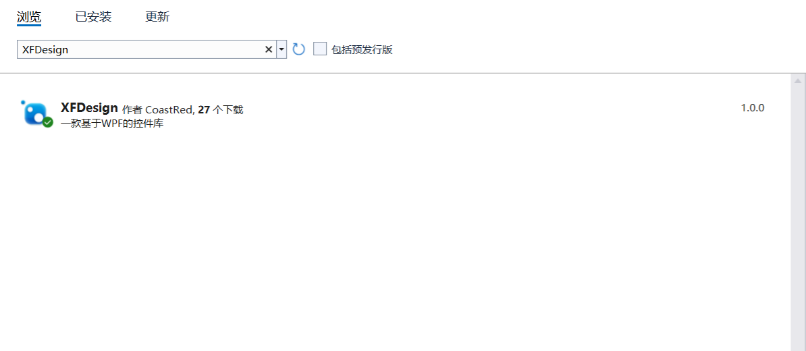

# XFDesign

项目文档：[https://www.yuque.com/u1897222/akzm0f/bqdz4o](https://www.yuque.com/u1897222/akzm0f/bqdz4o)

# 项目说明

- 一款基于WPF的开源控件库


# 功能简介

- 主要做WPF的扩展控件，只提供少量的原生控件样式
- 不会提供任何默认的原生控件样式（只要不主动添加样式，不会改变项目中的任何东西）
- 可以与其他控件库结合使用


# 开发环境

- 基于VS2022+.NET6


# 快速开始

## Nuget包



## 项目引用

- App.xaml

```xml
<ResourceDictionary Source="pack://application:,,,/XFDesign;component/Themes/Generic.xaml" />
```

- 要使用的界面

```xml
xmlns:xf="https://github.com/Coast/XFDesign"
```


# 扩展控件展示


# 扩展窗口展示

## 登录窗口

